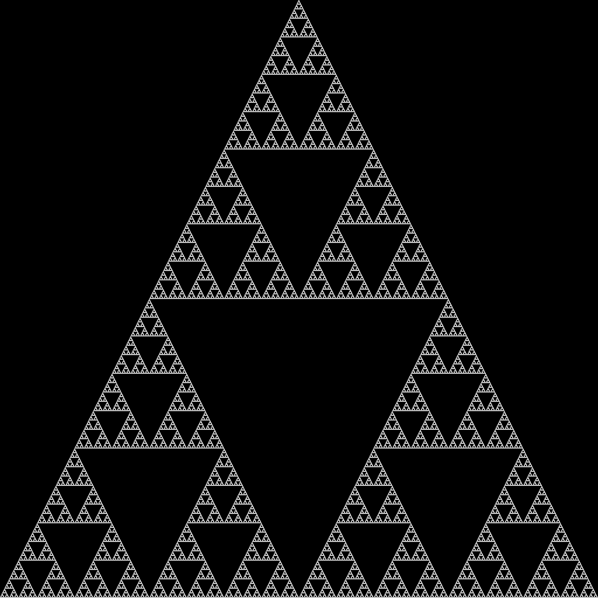

# Sierpinski's Triangle Generator

Generate Sierpinski's gasket using blazing-fast bit manipulation and a little bit of cheating.

Method is explained in [the code](./src/main.rs).

### Execution Instructions

1. [Install Rust](https://www.rust-lang.org/tools/install) if you haven't already
2. Download the project files
3. Open up a terminal in the project directory and run `cargo run --release`
4. The result will be saved to `out.png`
    - You can modify the size of the output by changing the constant in `main.rs`

### 1024x1024 Result

